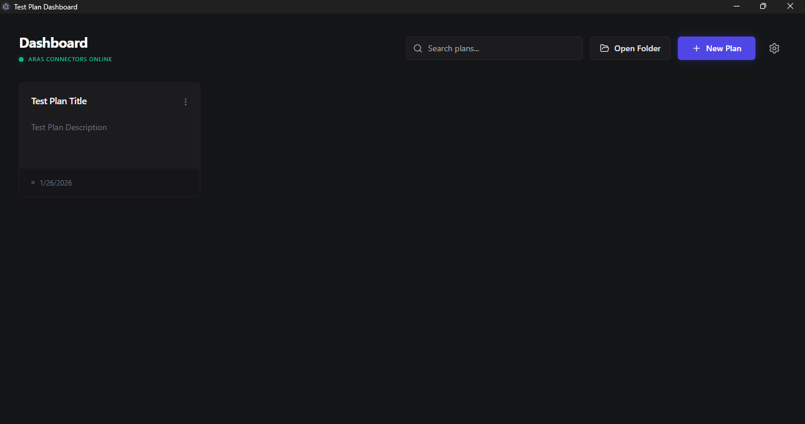

<div align="center">

# ARASTester

### The Modern, Automated Functional Testing Suite for ARAS Innovator


<br />



<br />

**[Report Bug](https://github.com/ashwin-2504/arastester/issues)** · **[Request Feature](https://github.com/ashwin-2504/arastester/issues)**

</div>

---

## 🚀 Why ARASTester?

Manual testing of ARAS PLM configurations is tedious, repetitive, and prone to human error. **ARASTester** changes the game.

Designed specifically for **ARAS PLM Testers** and **Configuration Developers**, this tool empowers you to build, organize, and execute complex test scenarios without writing a single line of code. Whether you're validating a new lifecycle map, checking permission models, or ensuring data integrity, ARASTester streamlines your workflow so you can focus on quality, not clicking.

## ✨ Key Features

### 🖱️ Visual Test Builder

Forget complex scripting. Build your test plans using a modern, intuitive **drag-and-drop interface**. Reorder tests, group actions, and modify parameters visually.

### ⚙️ Native ARAS Operations

Go beyond basic CRUD. ARASTester supports complex **Workflow** activities (Start Workflow, Complete Activity), **File Vault** operations (Upload/Download), and advanced **Lifecycle** promotions natively.

### 📂 Hierarchical Organization

Manage hundreds of test cases with ease. Our **nested test tree** allows you to structure your validation logic logically, just like your PLM data model.

### ✅ Advanced Assertions

Ensure your PLM logic is robust. Verify property values, check if items exist/don't exist, validate record counts, and verify lock statuses with dedicated assertion actions.

### 🔒 Privacy First & Local Storage

Your data is yours. ARASTester stores all test plans as local **JSON files**. No cloud uploads, no external servers. You have full control over your testing IP.

### 💾 Session Profiles

Save and manage multiple ARAS connection profiles. Link specific profiles to individual tests to automatically switch sessions during execution, ensuring your tests run in the correct environment every time.

## 🎯 Built for ARAS Professionals

- **For QA Teams**: Reduce regression testing time from days to minutes. Ensure consistent validation across every release.
- **For Developers**: Verify your configuration changes instantly. Share test plan JSON files with your team for version-controlled validation.

## 🏁 Getting Started

### Prerequisites

- Windows 10/11
- .NET 8 SDK (for backend development)
- Node.js (v18+)

### Installation

1.  **Clone the repository**
    ```bash
    git clone https://github.com/ashwin-2504/arastester.git
    ```
2.  **Install dependencies**
    ```bash
    npm install
    ```
3.  **Run the application**
    ```bash
    npm run dev
    ```

### Development Workflow

**Full App Dev**

- Starts both Backend (.NET) and Frontend (Electron/React)

```bash
npm run dev
```

**Frontend Dev (Hot Reload)**

- Uses Vite for faster UI iteration

```bash
npm run dev:server
```

**Electron Dev**

- Starts only the Electron shell

```bash
npm run dev:electron
```

## 💻 Technology Stack

- **Frontend**: React 19, Vite, Tailwind CSS, Radix UI, Framer Motion
- **Backend**: ASP.NET Core (.NET 8), Aras.IOM SDK
- **Desktop**: Electron 39
- **State Management**: Zustand, Immer, Local JSON Storage

---

## 📚 Documentation

For detailed technical documentation, see the [docs](docs/01_SYSTEM_OVERVIEW.md) folder:

- [System Overview](docs/01_SYSTEM_OVERVIEW.md)
- [Architecture](docs/02_ARCHITECTURE.md)
- [Data & Control Flow](docs/03_DATA_AND_CONTROL_FLOW.md)
- [Frontend Details](docs/04_FRONTEND.md)
- [Backend Details](docs/05_BACKEND.md)
- [Security & Failures](docs/06_SECURITY_AND_FAILURES.md)
- [Non-Goals & Gaps](docs/07_NON_GOALS_AND_GAPS.md)
- [API Reference](docs/API_REFERENCE.md)

---
