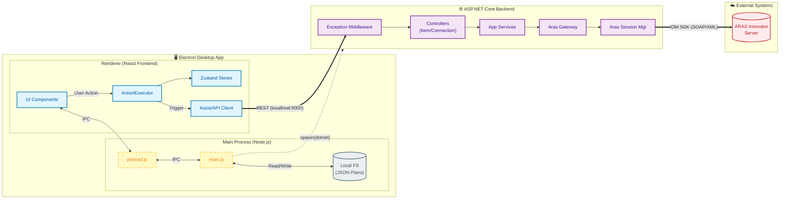

# 02_ARCHITECTURE

> ⚠ HUMAN REVIEW REQUIRED
>
> - Business logic interpretation
> - Security implications
> - Architectural intent

**Code Snapshot**: 2026-02-28

---

## System Architecture Diagram



## Data Flow Summary

| Flow                 | Path                                             | Protocol     |
| -------------------- | ------------------------------------------------ | ------------ |
| **Action Execution** | UI → ActionExecutor → apiClient → Backend → ARAS | HTTP → IOM   |
| **File Operations**  | UI → IPC → Main Process → File System            | Electron IPC |
| **State Updates**    | Backend Response → apiClient → Zustand → UI      | HTTP + React |

---

## 1. Observable Relationships (Code-Derived Only)

This section documents only relationships directly observable in code (e.g., Class A directly instantiates Class B). No architectural intent is assigned unless named in code.

### 1.1 Entry Point Chain (Frontend)

```
index.html (entry)
    └── script: /renderer/app/main.jsx
            └── imports: App (from ./App)
            └── renders to: document.getElementById('root')
```

**Source**: [index.html](../index.html), [main.jsx](../renderer/app/main.jsx)

### 1.2 Entry Point Chain (Electron Main Process)

```
main.js (entry per package.json "main")
    └── requires: electron (app, BrowserWindow, ipcMain, dialog, Menu)
    └── requires: child_process (spawn)
    └── spawns: backend/ArasBackend/bin/Debug/net8.0/win-x64/ArasBackend.exe
    └── loads: http://localhost:5173 (dev) OR dist/index.html (prod)
```

**Source**: [main.js](../main.js)

### 1.3 Entry Point Chain (Backend)

```
Program.cs (entry)
    └── calls: builder.Services.AddInfrastructure()
    └── calls: builder.Services.AddApplication()
    └── calls: builder.Services.AddControllers()
    └── uses middleware: ExceptionHandlingMiddleware
    └── maps controllers: app.MapControllers()
```

**Source**: [Program.cs](../backend/ArasBackend/Program.cs)

---

## 2. Namespaces and Folder Groupings

The following namespaces and folder groupings exist. **No architectural meaning is assigned** unless explicitly stated in code.

### 2.1 Backend Namespace Structure

| Folder                             | Namespace                                                                | Project File                      |
| ---------------------------------- | ------------------------------------------------------------------------ | --------------------------------- |
| backend/ArasBackend                | ArasBackend.Controllers                                                  | ArasBackend.csproj                |
| backend/ArasBackend.Core           | ArasBackend.Core.Models, ArasBackend.Core.Interfaces                     | ArasBackend.Core.csproj           |
| backend/ArasBackend.Application    | ArasBackend.Application.Services                                         | ArasBackend.Application.csproj    |
| backend/ArasBackend.Infrastructure | ArasBackend.Infrastructure.Gateways, ArasBackend.Infrastructure.Services | ArasBackend.Infrastructure.csproj |

**Source**: Namespace declarations in each file (verified in FACT_PUBLIC_INTERFACES.md)

### 2.2 Project References (from .csproj files)

```
ArasBackend (main host)
    ├── references: ArasBackend.Core
    ├── references: ArasBackend.Application
    └── references: ArasBackend.Infrastructure

ArasBackend.Application
    └── references: ArasBackend.Core

ArasBackend.Infrastructure
    └── references: ArasBackend.Core
```

**Source**: FACT_DEPENDENCIES.md

---

## 3. Controller → Service → Gateway Call Chain

Observable call chain from HTTP endpoint to ARAS IOM:

```
HTTP Request
    └── ItemController (injects ItemAppService)
            └── ItemAppService (injects IArasGateway)
                    └── ArasGateway (injects ArasSessionManager)
                            └── calls: Innovator.newItem(), item.apply(), etc.
```

**Observations**:

- `ItemController` directly calls `_itemService.*` methods (observed in FACT_PUBLIC_INTERFACES.md)
- `ArasGateway` uses `Aras.IOM.Innovator` object via `_sessionManager.Execute()` (observed in ArasGateway.cs Line 21)

---

## 4. Dependency Injection Setup

**Service Registration** (from Program.cs):

| Method              | Namespace                                | Line |
| ------------------- | ---------------------------------------- | ---- |
| AddInfrastructure() | ArasBackend.Infrastructure               | 23   |
| AddApplication()    | ArasBackend.Application                  | 24   |
| AddControllers()    | Microsoft.Extensions.DependencyInjection | 25   |

> **Design rationale not found in code or documentation.**

---

## 5. Communication Protocol

| From                | To           | Protocol      | Evidence                                       |
| ------------------- | ------------ | ------------- | ---------------------------------------------- |
| Frontend (Renderer) | Backend      | HTTP REST     | API endpoints in FACT_PUBLIC_INTERFACES.md     |
| Frontend (Renderer) | Main Process | Electron IPC  | IPC handlers in main.js (FACT_ENTRY_POINTS.md) |
| Main Process        | Backend      | Process spawn | spawn() call in main.js Line 68                |

---

## 6. Architectural Terminology in Code

The following terms appear explicitly in code comments or strings:

| Term                  | Location           | Context                                    |
| --------------------- | ------------------ | ------------------------------------------ |
| "Architecture Layers" | Program.cs Line 22 | Comment: "// Register Architecture Layers" |

> **Note**: The term "Layers" appears in a comment. This is the only explicit architectural terminology found.
