# 02_ARCHITECTURE

**Code Snapshot**: 2026-02-02

---

## System Architecture Diagram

```mermaid
flowchart LR
    %% --- Styles ---
    classDef react fill:#e1f5fe,stroke:#0277bd,stroke-width:2px,color:#01579b;
    classDef electron fill:#fff9c4,stroke:#fbc02d,stroke-width:2px,stroke-dasharray: 5 5,color:#f57f17;
    classDef dotnet fill:#f3e5f5,stroke:#7b1fa2,stroke-width:2px,color:#4a148c;
    classDef external fill:#ffebee,stroke:#c62828,stroke-width:2px,color:#b71c1c;
    classDef storage fill:#eceff1,stroke:#546e7a,stroke-width:2px,color:#37474f;

    %% --- Desktop App ---
    subgraph Desktop ["🖥️ Electron Desktop App"]
        direction TB

        subgraph MainProcess ["Main Process (Node.js)"]
            Main["main.js"]:::electron
            Preload["preload.js"]:::electron
            FS[("Local FS<br/>(JSON Plans)")]:::storage
        end

        subgraph Renderer ["Renderer (React Frontend)"]
            UI["UI Components"]:::react
            Store["Zustand Stores"]:::react
            Executor["ActionExecutor"]:::react
            API["Axios/API Client"]:::react
        end
    end

    %% --- Backend App ---
    subgraph Backend ["⚙️ ASP.NET Core Backend (Clean Arch)"]
        direction TB
        Middleware["Exception Middleware"]:::dotnet
        Controllers["Controllers<br/>(Presentation)"]:::dotnet
        SessionCtx["WebSessionContext<br/>(Presentation)"]:::dotnet
        Services["App Services<br/>(Application)"]:::dotnet
        Gateway["Aras Gateway<br/>(Infrastructure)"]:::dotnet
        SessionMgr["Aras Session Mgr<br/>(Infrastructure)"]:::dotnet
    end

    %% --- External ---
    subgraph External ["☁️ External Systems"]
        ARAS[("ARAS Innovator<br/>Server")]:::external
    end

    %% --- Relations: Electron Internals ---
    UI -->|"User Action"| Executor
    Executor --> Store
    Executor -->|"Trigger"| API
    UI <-->|"IPC"| Preload
    Preload <-->|"IPC"| Main
    Main <-->|"Read/Write"| FS

    %% --- Relations: System Startup ---
    Main -.->|"spawn(dotnet)"| Backend

    %% --- Relations: HTTP Flow ---
    API ==>|"REST (localhost:5000)"| Middleware
    Middleware --> Controllers
    Controllers --> Services
    Services --> Gateway
    Gateway --"Uses"--> SessionMgr
    SessionMgr -.->|"Resolves ID"| SessionCtx
    SessionMgr ==>|"IOM SDK (SOAP/XML)"| ARAS
```



## Data Flow Summary

| Flow                 | Path                                             | Protocol     |
| -------------------- | ------------------------------------------------ | ------------ |
| **Action Execution** | UI → ActionExecutor → apiClient → Backend → ARAS | HTTP → IOM   |
| **File Operations**  | UI → IPC → Main Process → File System            | Electron IPC |
| **State Updates**    | Backend Response → apiClient → Zustand → UI      | HTTP + React |

---

## 1. Observable Relationships (Code-Derived Only)

This section documents only relationships directly observable in code (e.g., Class A directly instantiates Class B). No architectural intent is assigned unless named in code.

### 1.1 Entry Point Chain (Frontend)

```
index.html (entry)
    └── script: /renderer/app/main.jsx
            └── imports: App (from ./App)
            └── renders to: document.getElementById('root')
```

**Source**: [index.html](../index.html), [main.jsx](../renderer/app/main.jsx)

### 1.2 Entry Point Chain (Electron Main Process)

```
main.js (entry per package.json "main")
    └── requires: electron (app, BrowserWindow, ipcMain, dialog, Menu)
    └── requires: child_process (spawn)
    └── spawns: backend/ArasBackend/bin/Debug/net8.0/win-x64/ArasBackend.exe
    └── loads: http://localhost:5173 (dev) OR dist/index.html (prod)
```

**Source**: [main.js](../main.js)

### 1.3 Entry Point Chain (Backend)

```
Program.cs (entry)
    └── calls: builder.Services.AddHttpContextAccessor()
    └── calls: builder.Services.AddScoped<ISessionContext, WebSessionContext>()
    └── calls: builder.Services.AddInfrastructure()
    └── calls: builder.Services.AddApplication()
    └── calls: builder.Services.AddControllers()
    └── uses middleware: ExceptionHandlingMiddleware
    └── maps controllers: app.MapControllers()
```

**Source**: [Program.cs](../backend/ArasBackend/Program.cs)

---

## 2. Namespaces and Folder Groupings

The following namespaces and folder groupings exist. **No architectural meaning is assigned** unless explicitly stated in code.

### 2.1 Backend Namespace Structure

| Folder                             | Namespace                                                                | Project File                      |
| ---------------------------------- | ------------------------------------------------------------------------ | --------------------------------- |
| backend/ArasBackend                | ArasBackend.Controllers, ArasBackend.Services                            | ArasBackend.csproj                |
| backend/ArasBackend.Core           | ArasBackend.Core.Models, ArasBackend.Core.Interfaces                     | ArasBackend.Core.csproj           |
| backend/ArasBackend.Application    | ArasBackend.Application.Services, ArasBackend.Application.Interfaces     | ArasBackend.Application.csproj    |
| backend/ArasBackend.Infrastructure | ArasBackend.Infrastructure.Gateways, ArasBackend.Infrastructure.Services | ArasBackend.Infrastructure.csproj |

**Source**: Namespace declarations in each file

### 2.2 Project References (from .csproj files)

```
ArasBackend (main host / Presentation)
    ├── references: ArasBackend.Application
    └── references: ArasBackend.Infrastructure
        └── references: ArasBackend.Core
    └── references: ArasBackend.Core (transitive/direct)

ArasBackend.Infrastructure
    ├── references: ArasBackend.Application (for interfaces)
    └── references: ArasBackend.Core

ArasBackend.Application
    └── references: ArasBackend.Core
```

**Source**: Project dependencies have been refactored for Clean Architecture.

---

## 3. Controller → Service → Gateway Call Chain

Observable call chain from HTTP endpoint to ARAS IOM:

```
HTTP Request
    ├── [Session Extraction via WebSessionContext]
    └── ItemController (injects ItemAppService)
            └── ItemAppService (injects IArasGateway)
                    └── ArasGateway (injects ArasSessionManager)
                            ├── uses: ISessionContext.SessionId (resolved from WebSessionContext)
                            └── calls: Innovator.newItem(), item.apply(), etc.
```

**Observations**:

- `ItemController` delegates entirely to `IItemAppService`.
- `ArasGateway` no longer depends on `IHttpContextAccessor` directly; it relies on `ISessionContext` to be host-agnostic.
- `ArasSessionManager` uses `ISessionContext` to look up the correct IOM connection from its cache.

---

## 4. Dependency Injection Setup

**Service Registration** (from Program.cs):

| Method                 | Namespace                                | Line (Approx) | Purpose                                           |
| ---------------------- | ---------------------------------------- | ------------- | ------------------------------------------------- |
| AddHttpContextAccessor | Microsoft.AspNetCore.Http                | 23            | Access to Request/Context                         |
| AddScoped              | Microsoft.Extensions.DependencyInjection | 24            | Register `WebSessionContext` as `ISessionContext` |
| AddInfrastructure()    | ArasBackend.Infrastructure               | 26            | Gateways, SessionManager                          |
| AddApplication()       | ArasBackend.Application                  | 27            | App Services, Validators                          |
| AddControllers()       | Microsoft.Extensions.DependencyInjection | 28            | API Controllers                                   |

> **Design Rationale**: Setup enforces Clean Architecture. `ArasBackend` (Web) acts as the Composition Root and Presentation Layer. The Application and Infrastructure layers are registered via their respective extension methods.

---

## 5. Communication Protocol

| From                | To           | Protocol      | Evidence                                       |
| ------------------- | ------------ | ------------- | ---------------------------------------------- |
| Frontend (Renderer) | Backend      | HTTP REST     | API endpoints in FACT_PUBLIC_INTERFACES.md     |
| Frontend (Renderer) | Main Process | Electron IPC  | IPC handlers in main.js (FACT_ENTRY_POINTS.md) |
| Main Process        | Backend      | Process spawn | spawn() call in main.js Line 68                |

---

## 6. Architectural Terminology in Code

The following terms appear explicitly in code comments or strings:

| Term                  | Location           | Context                                    |
| --------------------- | ------------------ | ------------------------------------------ |
| "Architecture Layers" | Program.cs Line 22 | Comment: "// Register Architecture Layers" |

> **Note**: The term "Layers" appears in a comment. This is the only explicit architectural terminology found.
