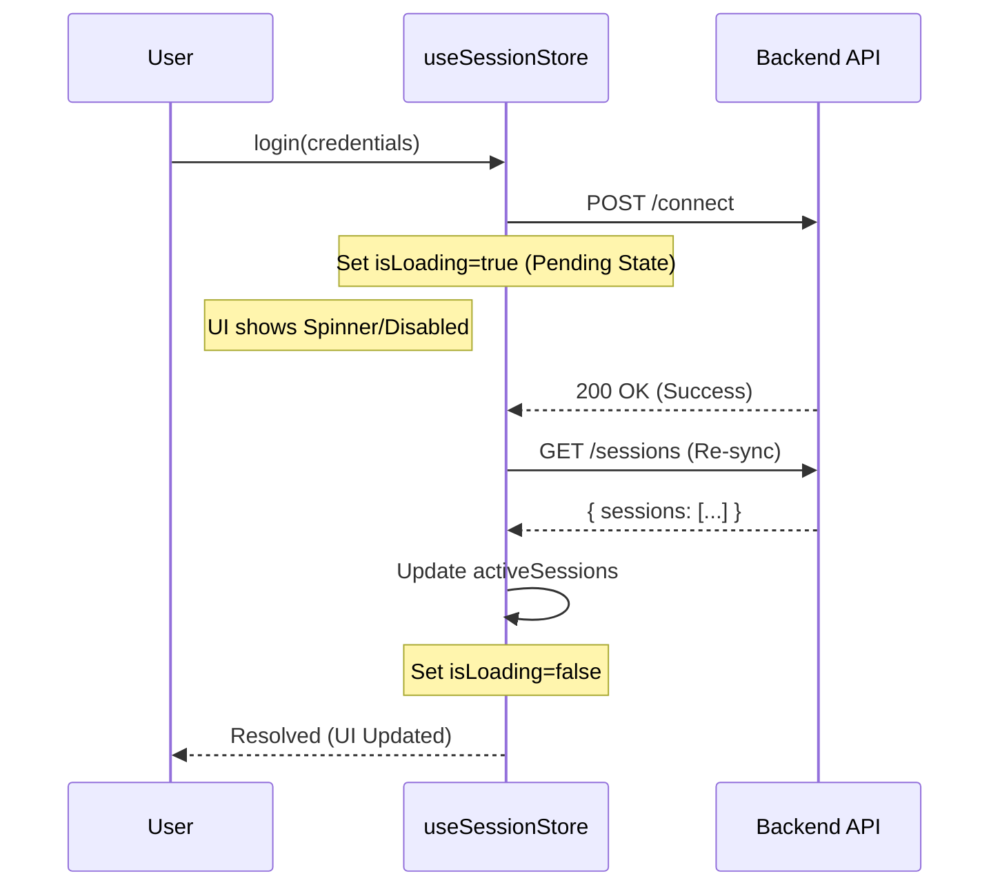

# 04_FRONTEND

**Code Snapshot**: 2026-02-02

---

## 1. Technology Stack (from FACT_DEPENDENCIES.md)

| Package                       | Version  | Purpose (if explicit) |
| ----------------------------- | -------- | --------------------- |
| react                         | ^19.2.0  | UI Framework          |
| react-dom                     | ^19.2.0  | DOM Rendering         |
| react-router-dom              | ^7.12.0  | Routing               |
| zustand                       | ^5.0.10  | State Management      |
| @hello-pangea/dnd             | ^16.5.0  | Drag and Drop         |
| @radix-ui/react-dialog        | ^1.1.15  | Dialog Component      |
| @radix-ui/react-dropdown-menu | ^2.1.16  | Dropdown Menu         |
| @radix-ui/react-scroll-area   | ^1.2.10  | Scroll Area           |
| @radix-ui/react-slot          | ^1.2.4   | Slot Component        |
| lucide-react                  | ^0.554.0 | Icons                 |
| tailwindcss-animate           | ^1.0.7   | Animations            |
| tailwindcss                   | ^3.4.17  | CSS Framework         |
| vite                          | ^7.2.2   | Build Tool            |

---

## 2. File Structure (Verified)

```
renderer/
├── app/
│   └── main.jsx            # React entry point
├── components/
│   ├── layout/             # 2 files
│   ├── plan/               # 1 file
│   ├── schema/             # 4 files
│   ├── session/            # 4 files
│   ├── tree/               # 2 files
│   ├── ui/                 # 10 files
│   ├── BackendStatus.tsx
│   ├── JsonViewer.tsx
│   ├── PlanModal.jsx
│   └── TestTree.tsx
├── core/
│   ├── adapters/           # 2 files
│   ├── api/                # 1 file
│   ├── ipc/                # 1 file
│   ├── registries/         # 1 file
│   ├── schemas/            # 1 file (action-schemas.json)
│   └── services/           # 1 file
├── layouts/                # 1 file
├── lib/
│   ├── hooks/
│   ├── idGenerator.ts
│   ├── logger.ts
│   └── utils.ts
├── routes/
│   ├── Dashboard/          # 2 files
│   ├── PlanDetails/        # 2 files
│   └── Settings/           # 1 file
├── stores/
│   ├── usePlanCacheStore.js
│   └── useUiStore.js
└── globals.css
```

**Source**: File system listing

---

## 3. Data Flow & State Synchronization

### 3.1 Global State (Zustand)

**Library**: `zustand` ^5.0.10

#### useSessionStore (`renderer/stores/useSessionStore.ts`)

Manages global connectivity state.

- **Responsibility**: Maintains the list of _active_ sessions and the _current_ session context.
- **Invariant**: This store **NEVER** optimistically updates connection status. It always awaits backend confirmation and then refetches the source of truth.

**Sync Flow (Login):**



> **Note on Pending State**: Between the API call and the final store update, the UI remains in a "Loading/Pending" state (`isLoading=true`). It does **not** show the session as "Connected" until the re-sync completes. Stale state is temporarily visible but disabled/overlaid by the loading indicator.

#### useUiStore (`renderer/stores/useUiStore.js`)

UI state management for layout controls (Sidebar toggles).

#### usePlanCacheStore (`renderer/stores/usePlanCacheStore.js`)

Caches loaded test plans in memory.

---

## 4. Component Responsibilities

| Component          | Type     | Responsibility                                                                                                 |
| ------------------ | -------- | -------------------------------------------------------------------------------------------------------------- |
| **SessionManager** | UI/Logic | Manages **Persisted Profile Definitions** (Local JSON). _Does not_ own runtime connection state.               |
| **ActionExecutor** | Service  | Handles **Runtime Session Switching** during test execution. Implements the `sessionProfileId` override logic. |
| **ProfileCard**    | UI       | Visualizes session state (`activeSessions`) and freshness.                                                     |
| **ArasController** | Backend  | **Source of Truth** for IOM `HttpServerConnection` objects.                                                    |

---

## 5. Action Executor (`renderer/core/services/ActionExecutor.ts`)

Core service that executes test actions. Handles both client-side and server-side actions.

### Execution Flow

1.  **Plugin Resolution**: Retrieves action implementation logic from `ActionRegistry`.
2.  **Session Context**: Resolves which ARAS session to use (Explicit `sessionName` override vs Current Session).
3.  **Client-Side Actions**: Executes logic locally (e.g., `Wait`, `LogMessage`, `SetVariable`).
4.  **Server-Side Actions**: Forwards params to Backend API endpoints via `apiClient`.
5.  **State Sync**: For `ArasConnect` and `ArasDisconnect`, automatically triggers a session list refresh.

### Client-Side Actions

| Action Type   | Behavior                               |
| ------------- | -------------------------------------- |
| `Wait`        | `await setTimeout(duration)`           |
| `LogMessage`  | `console.log(level, message)`          |
| `SetVariable` | Stores variable in session log/context |

---

## 6. Action Schema (from core/schemas/action-schemas.json)

The frontend uses a schema-driven approach for ARAS actions.

| Category                    | Count     | Status         |
| --------------------------- | --------- | -------------- |
| Connection & Authentication | 3 actions | ✅ Implemented |
| Item CRUD Operations        | 7 actions | ✅ Implemented |
| Lock Operations             | 3 actions | ✅ Implemented |
| Lifecycle Operations        | 2 actions | ✅ Implemented |
| Relationship Operations     | 3 actions | ✅ Implemented |
| Workflow Operations         | 3 actions | ✅ Implemented |
| AML & SQL Execution         | 3 actions | ✅ Implemented |
| Assertion / Verification    | 8 actions | ✅ Implemented |
| File Vault Operations       | 3 actions | ✅ Implemented |
| Utility Actions             | 7 actions | ✅ Implemented |

**Total**: 42 actions fully mapped to Backend endpoints.

**Source**: FACT_PUBLIC_INTERFACES.md (backend API mappings correspond to schema actions)
