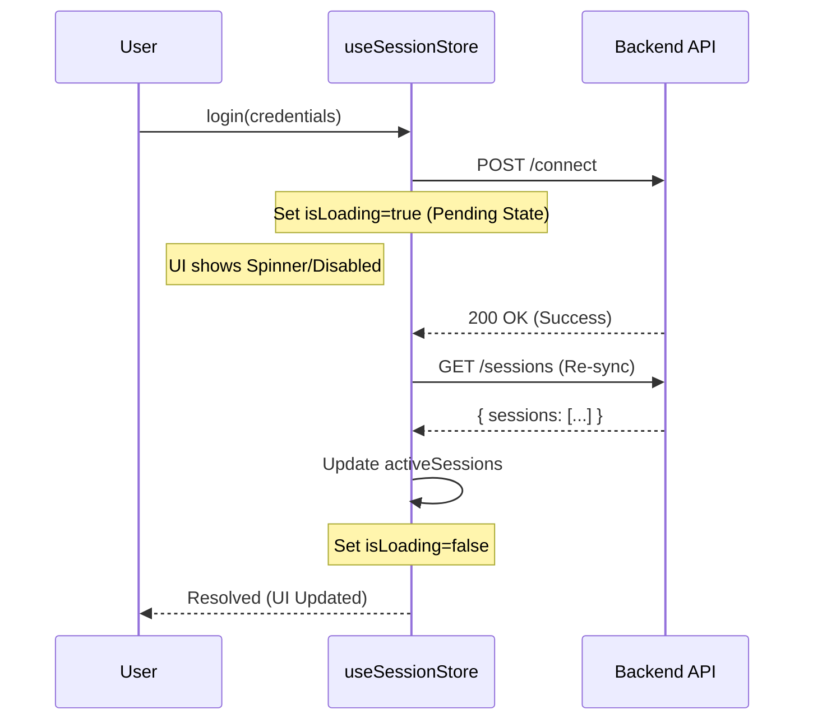

# 04_FRONTEND

> ⚠ HUMAN REVIEW REQUIRED
>
> - Business logic interpretation
> - Security implications
> - Architectural intent

**Code Snapshot**: 2026-02-28

---

## 1. Technology Stack (from FACT_DEPENDENCIES.md)

| Package                       | Version  | Purpose (if explicit) |
| ----------------------------- | -------- | --------------------- |
| react                         | ^19.2.0  | UI Framework          |
| react-dom                     | ^19.2.0  | DOM Rendering         |
| react-router-dom              | ^7.12.0  | Routing               |
| zustand                       | ^5.0.10  | State Management      |
| @hello-pangea/dnd             | ^16.5.0  | Drag and Drop         |
| @radix-ui/react-dialog        | ^1.1.15  | Dialog Component      |
| @radix-ui/react-dropdown-menu | ^2.1.16  | Dropdown Menu         |
| @radix-ui/react-scroll-area   | ^1.2.10  | Scroll Area           |
| @radix-ui/react-slot          | ^1.2.4   | Slot Component        |
| lucide-react                  | ^0.554.0 | Icons                 |
| framer-motion                 | ^12.26.2 | Animations            |
| tailwindcss                   | ^3.4.17  | CSS Framework         |
| vite                          | ^7.2.2   | Build Tool            |

---

## 2. File Structure (Verified)

```
renderer/
├── app/
│   └── main.jsx            # React entry point
├── components/
│   ├── BackendStatus.jsx
│   ├── JsonViewer.jsx
│   ├── PlanModal.jsx
│   ├── TestTree.jsx
│   ├── schema/             # 4 files
│   ├── tree/               # 2 files
│   └── ui/                 # 8 files
├── core/
│   ├── adapters/           # 2 files
│   ├── api/                # 1 file
│   ├── ipc/                # 1 file
│   ├── registries/         # 1 file
│   ├── schemas/            # 1 file (action-schemas.json)
│   └── services/           # 1 file
├── layouts/                # 1 file
├── routes/
│   ├── Dashboard/          # 2 files
│   ├── PlanDetails/        # 2 files
│   └── Settings/           # 1 file
├── stores/
│   ├── usePlanCacheStore.js
│   └── useUiStore.js
└── globals.css
```

**Source**: File system listing

---

## 3. Data Flow & State Synchronization

### 3.1 Global State (Zustand)

**Library**: `zustand` ^5.0.10

#### useSessionStore (`renderer/stores/useSessionStore.ts`)

Manages global connectivity state.

- **Responsibility**: Maintains the list of _active_ sessions and the _current_ session context.
- **Invariant**: This store **NEVER** optimistically updates connection status. It always awaits backend confirmation and then refetches the source of truth.

**Sync Flow (Login):**



> **Note on Pending State**: Between the API call and the final store update, the UI remains in a "Loading/Pending" state (`isLoading=true`). It does **not** show the session as "Connected" until the re-sync completes. Stale state is temporarily visible but disabled/overlaid by the loading indicator.

#### useUiStore (`renderer/stores/useUiStore.js`)

UI state management for layout controls (Sidebar toggles).

#### usePlanCacheStore (`renderer/stores/usePlanCacheStore.js`)

Caches loaded test plans in memory.

---

## 4. Component Responsibilities

| Component          | Type     | Responsibility                                                                                                 |
| ------------------ | -------- | -------------------------------------------------------------------------------------------------------------- |
| **SessionManager** | UI/Logic | Manages **Persisted Profile Definitions** (Local JSON). _Does not_ own runtime connection state.               |
| **ActionExecutor** | Service  | Handles **Runtime Session Switching** during test execution. Implements the `sessionProfileId` override logic. |
| **ProfileCard**    | UI       | Visualizes session state (`activeSessions`) and freshness.                                                     |
| **ArasController** | Backend  | **Source of Truth** for IOM `HttpServerConnection` objects.                                                    |

---

## 5. Action Executor (`renderer/core/services/ActionExecutor.js`)

Core service that executes test actions. Handles both client-side and server-side actions.

### Execution Flow

```
ActionExecutor.execute(action)
    │
    ├── Client-Side Action? → executeClientSide()
    │       ├── Wait → setTimeout
    │       ├── LogMessage → console.log
    │       ├── SetVariable → (future: context store)
    │       └── Custom → (mock execution)
    │
    └── Server-Side Action? → executeServerSide()
            └── apiClient.post(endpoint, params)
```

### Client-Side Actions (Lines 62-83)

| Action Type   | Behavior                               |
| ------------- | -------------------------------------- |
| `Wait`        | `await setTimeout(duration)`           |
| `LogMessage`  | `console.log(level, message)`          |
| `SetVariable` | Logs variable (future: context store)  |
| `Custom`      | Mock execution (not fully implemented) |

### Server-Side Actions (Lines 41-58)

```javascript
if (plugin.apiMethod === "GET") {
  data = await apiClient.get(plugin.apiEndpoint);
} else {
  data = await apiClient.post(plugin.apiEndpoint, action.params || {});
}
```

**Response Normalization**: Converts PascalCase (`Success`) to camelCase (`success`).

---

## 4. Entry Script (from FACT_ENTRY_POINTS.md)

| Setting      | Value                                                       |
| ------------ | ----------------------------------------------------------- |
| Entry File   | /renderer/app/main.jsx                                      |
| Root Element | document.getElementById('root')                             |
| CSS Import   | ../globals.css                                              |
| React Mode   | NOT in StrictMode (no wrapper observed)                     |
| Dark Mode    | Forced via `document.documentElement.classList.add('dark')` |

**Source**: main.jsx Lines 7, 12

---

## 5. IPC API (from FACT_ENTRY_POINTS.md)

Frontend can invoke these channels via `window.electronAPI`:

| Channel           | Purpose                   |
| ----------------- | ------------------------- |
| dialog:pickFolder | Open folder picker dialog |
| fs:readFile       | Read file contents        |
| fs:writeFile      | Write JSON to file        |
| fs:listJsonFiles  | List JSON files in folder |
| fs:deleteFile     | Delete a file             |
| settings:read     | Read user settings        |
| settings:write    | Write user settings       |

---

## 6. Action Schema (from core/schemas/action-schemas.json)

The frontend uses a schema-driven approach for ARAS actions. Key observations:

| Category                    | Count      |
| --------------------------- | ---------- |
| Connection & Authentication | 3 actions  |
| Item CRUD Operations        | 7 actions  |
| Lock Operations             | 3 actions  |
| Lifecycle Operations        | 2 actions  |
| Relationship Operations     | 3 actions  |
| Workflow Operations         | 3 actions  |
| AML & SQL Execution         | 3 actions  |
| Assertion / Verification    | 4+ actions |

**Source**: FACT_PUBLIC_INTERFACES.md (backend API mappings correspond to schema actions)
